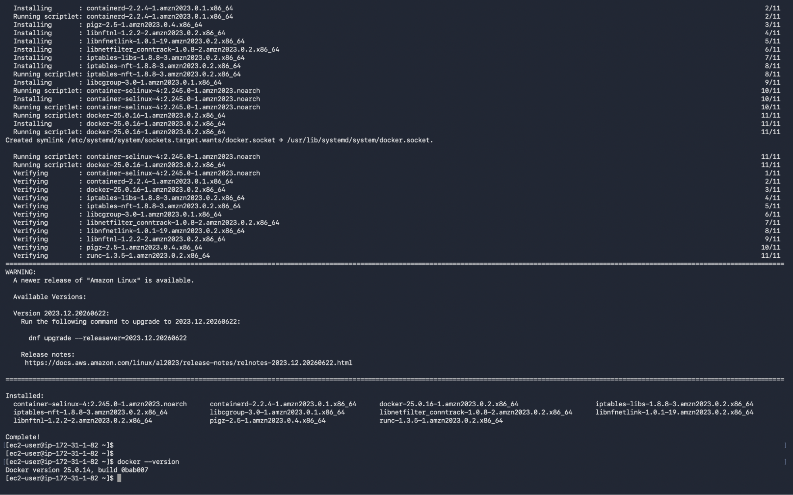
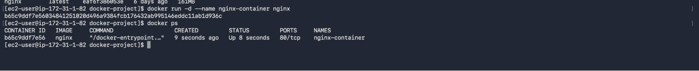
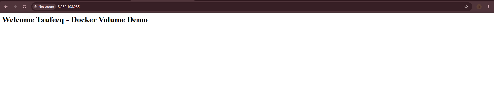
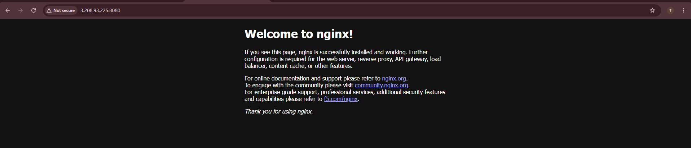
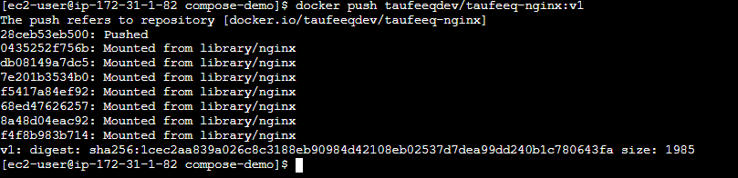
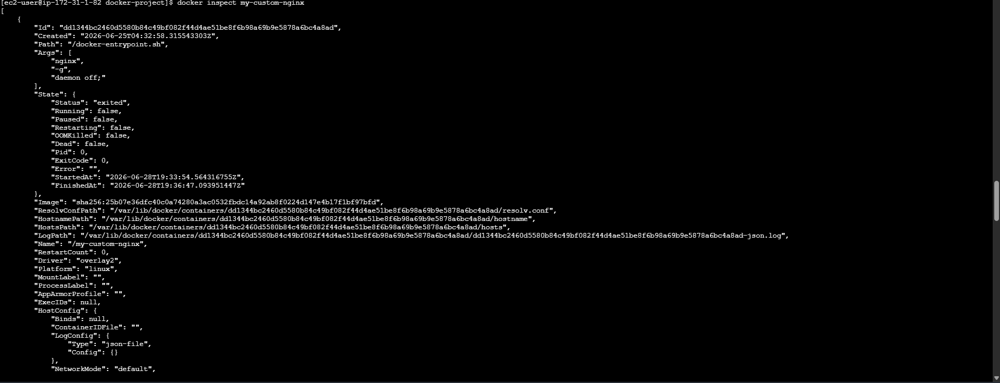
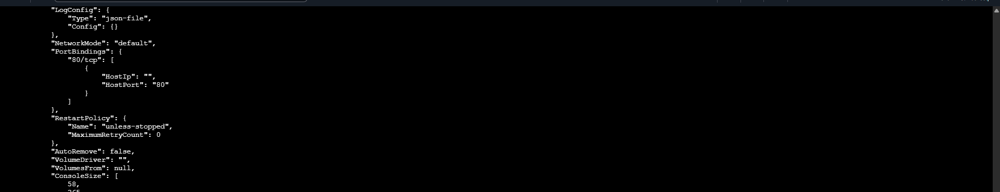
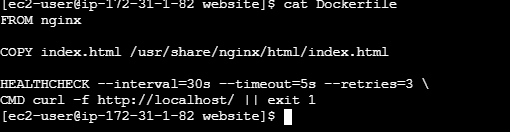

# Docker Containerization

## Project Overview

Implemented Docker containerization by creating and managing containers, building custom Docker images, configuring persistent storage, networking multiple containers, deploying applications using Docker Compose, publishing images to Docker Hub, and implementing restart policies and health checks.

---

## Project Goal

Learn and implement Docker to package, deploy, and manage applications in containers while understanding the complete container lifecycle, networking, storage, orchestration, and image management.

---

## Implementation Journey

### Step 1 - Docker Installation

- Installed Docker on the Linux server.
- Verified the installation and Docker service.

---

### Step 2 - Container Creation and Deployment

- Downloaded Docker images from Docker Hub.
- Created and executed Docker containers.
- Configured port mapping and verified the application through the browser.

---

### Step 3 - Docker Volumes

- Created Docker volumes for persistent storage.
- Mounted volumes inside containers.
- Verified data persistence after container recreation.

---

### Step 4 - Docker Networking

- Created a custom Docker network.
- Connected multiple containers to the same network.
- Verified communication between containers using container names.

---

### Step 5 - Docker Compose

- Installed Docker Compose.
- Created a multi-container application using `docker-compose.yml`.
- Verified successful deployment of all services.

---

### Step 6 - Docker Hub Integration

- Tagged Docker images using the Docker Hub repository.
- Published custom Docker images to Docker Hub.
- Verified the uploaded repository.

---

### Step 7 - Restart Policy

- Configured automatic container restart using restart policies.
- Verified container recovery after restarting Docker.

---

### Step 8 - Health Check

- Configured Docker Health Checks.
- Verified application health instead of relying only on container status.

---

## Challenges Faced

### Challenge 1 - Application Not Accessible

**Issue**

The Docker container was running successfully, but the application was not accessible through the browser.

**Resolution**

Verified Docker port mapping and updated the AWS Security Group to allow inbound HTTP traffic.

**Learning**

A running container does not guarantee external accessibility. Network configuration and firewall rules must also be verified.

---

### Challenge 2 - Docker Compose Setup

**Issue**

Docker Compose was not available after installing Docker.

**Resolution**

Installed Docker Compose separately and verified the installation before deploying the application.

**Learning**

Docker Engine and Docker Compose are separate components and should be verified individually.

---

### Challenge 3 - Docker Hub Image Push

**Issue**

Initially attempted to push Docker images without understanding image tagging.

**Resolution**

Tagged the local image with the Docker Hub repository name before pushing.

**Learning**

Images must be tagged correctly before they can be published to Docker Hub.

---

### Challenge 4 - Understanding Container Health

**Issue**

Initially assumed that a running container meant the application was healthy.

**Resolution**

Configured Docker Health Checks to continuously verify application availability.

**Learning**

Container status and application health are different. Health checks provide better monitoring of application availability.

---

## Key Learnings

- Installed and configured Docker on Linux.
- Created and managed Docker images and containers.
- Implemented persistent storage using Docker Volumes.
- Configured Docker Networks for container communication.
- Built custom Docker images using Dockerfile.
- Deployed multi-container applications using Docker Compose.
- Published Docker images to Docker Hub.
- Implemented Restart Policies and Health Checks.
- Understood the complete Docker container lifecycle.

---

## Project Outcome

Successfully implemented Docker containerization by managing images, containers, storage, networking, orchestration, image publishing, and health monitoring. This project strengthened my understanding of deploying and managing containerized applications in a real-world environment.

---

## Source Code

The Docker files used in this project are available in the `source-code` directory.

- Dockerfile
- docker-compose.yml
- index.html
